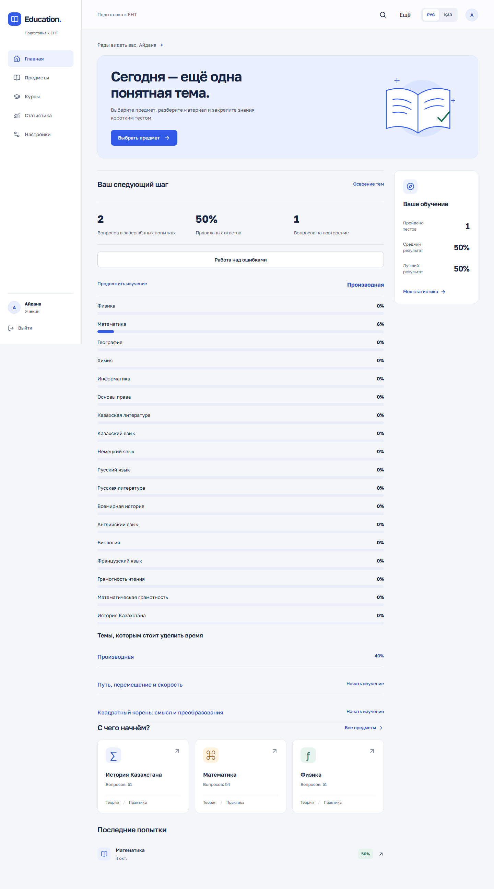
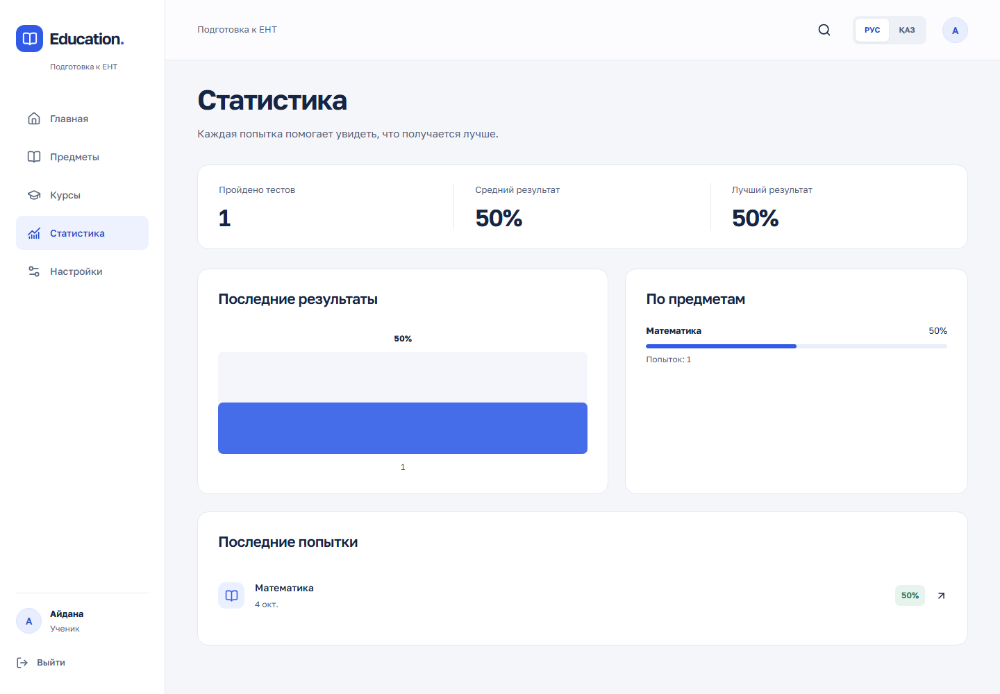

# Education App

Рабочая платформа подготовки к ЕНТ / ҰБТ: теория по темам, тестовые попытки, разбор ответов и личная статистика на русском и казахском языках.

Проект восстановлен из предоставленных frontend/backend архивов и объединён в monorepo. Учебный набор намеренно небольшой: **3 предмета, 4 темы, 6 вопросов и 5 материалов**. Это платформа на текущем контенте, а не полный курс или официальный банк заданий ЕНТ.



<details>
<summary>Другие экраны</summary>





Снимки сделаны автоматизированным браузером на реальной базе. Учётная запись и результаты на них созданы проверочным сценарием.
</details>

## Возможности

- Регистрация, вход, выход, восстановление сессии после обновления страницы, обработка истёкшего JWT.
- RU/KZ для навигации, форм, ошибок, теории, тестов, результатов и настроек. Язык сохраняется на устройстве и в профиле.
- Каталог предметов с реальным числом активных вопросов, темы и материалы с удобной шириной чтения.
- Сохранение ответов на сервере, продолжение незавершённого теста, подтверждение выхода и досрочного завершения.
- Правильные ответы и объяснения доступны только после завершения. Вопросы фиксируются при старте попытки.
- Статистика завершённых попыток: количество, средний и лучший результат, история, показатели по предметам.
- Responsive desktop/tablet/mobile, клавиатурные элементы управления, reduced motion и проверка контраста.
- Защищённый ADMIN CRUD API. Отдельная admin-панель в этой версии не реализована; контракты и создание администратора описаны в [API](docs/API.md).

## Архитектура

```text
education-app/
├── frontend/            React + strict TypeScript + Vite
├── backend/             Java 21 + Spring Boot + Maven Wrapper
├── scripts/             Настройка окружения и Python Playwright
├── docs/                Аудит, API, дизайн, проверки, screenshots
├── .github/workflows/   Backend, frontend и браузерный CI
├── .env.example
└── docker-compose.yml
```

Frontend: React 19, React Router, Tailwind 4 и небольшой собственный дизайн-комплект; Radix используется для диалогов подтверждения, Lucide — для иконок. Шрифт Golos Text хранится локально в сборке. Zod проверяет ответы API. MUI, Axios и неиспользуемые компоненты старого экспорта удалены.

Backend: Spring Boot 3.5, Spring Security, JJWT, BCrypt, Spring Data JPA, PostgreSQL 17 и Flyway. DTO отделены от entities. Тестовые изменения выполняются транзакционно с блокировкой строки попытки. Статистика агрегируется SQL-запросами по текущему пользователю.

Production-сборка: браузер → Nginx → `/api` Spring → PostgreSQL. В разработке Vite проксирует `/api` в backend. См. [аудит](docs/AUDIT.md), [дизайн](docs/DESIGN.md), [проверки и review](docs/VERIFICATION.md).

## Быстрый запуск: только Docker

Требуются Git и запущенный Docker Desktop / Docker Engine с Compose v2. Выполняйте команды из корня репозитория.

Windows PowerShell:

```powershell
.\scripts\setup.ps1
docker compose --profile app up -d --build --wait
```

Linux/macOS:

```sh
sh scripts/setup.sh
docker compose --profile app up -d --build --wait
```

Скрипт создаёт **локальный `.env` со случайными секретами**, не печатает их и сохраняет существующий файл. На Windows при запрете локальных скриптов можно выполнить `powershell -ExecutionPolicy Bypass -File scripts/setup.ps1`.

- Приложение: [http://localhost:8081](http://localhost:8081)
- Backend: [http://localhost:8080/api/test/ping](http://localhost:8080/api/test/ping)
- PostgreSQL: `localhost:55432`, база `education` (при настройке через setup).

Регистрируйте собственный аккаунт. Готовых логинов, паролей и автоматических администраторов нет. Flyway создаёт схему и учебный контент при запуске backend. Данные PostgreSQL сохраняются в Docker volume.

```sh
docker compose --profile app ps
docker compose logs --tail 100 backend
docker compose --profile app stop
```

`stop` сохраняет контейнеры и данные. `down` также сохраняет volume; `down -v` удаляет базу, поэтому не используйте его для обычной остановки.

## Разработка с Java и Node

Требуются **JDK 21**, **Node.js 24 LTS**, npm и Docker. Maven устанавливать отдельно не нужно. Укажите `JAVA_HOME` на JDK 21, если он не настроен.

1. Создайте `.env` командой setup выше. Если полный стек уже запущен, остановите только web-сервисы, чтобы освободить порт:

```sh
docker compose --profile app stop frontend backend
docker compose up -d --wait postgres
```

2. Backend в отдельном терминале:

```powershell
.\scripts\backend.ps1 run
```

Для Linux/macOS:

```sh
set -a
. ./.env
set +a
cd backend
chmod +x mvnw
./mvnw spring-boot:run
```

3. Frontend в другом терминале:

```sh
cd frontend
npm ci
npm run dev
```

Откройте [http://localhost:5173](http://localhost:5173). Deep links и обновление защищённых страниц поддерживаются Vite и production Nginx.

### Переменные окружения

Корневой `.env` читает Compose; для Maven его загружает PowerShell-скрипт или shell-команды выше. Spring сам `.env` не загружает.

| Переменная | Назначение |
| --- | --- |
| `DB_URL` | JDBC URL для локального backend; Compose подставляет внутреннее имя `postgres` |
| `DB_USERNAME`, `DB_PASSWORD` | Доступ к БД |
| `DB_NAME`, `DB_PORT` | База и локальный порт контейнера PostgreSQL |
| `APP_JWT_SECRET` | Случайная строка длиной минимум 32 байта; обязательна |
| `APP_JWT_EXPIRATION_MS` | Время жизни JWT, по умолчанию 86400000 мс |
| `CORS_ALLOWED_ORIGINS` | Точный список разрешённых origins через запятую |
| `PORT` | Порт Spring, по умолчанию 8080 |

Frontend может использовать два варианта. По умолчанию `VITE_API_BASE_URL` пуст и Vite проксирует `/api` на `http://localhost:8080`. Чтобы изменить proxy, создайте `frontend/.env` по [примеру](frontend/.env.example) и задайте `VITE_API_PROXY_TARGET`.

Для отдельного API origin задайте `VITE_API_BASE_URL=https://api.example.org` **без `/api`**, разрешите frontend origin в backend CORS и пересоберите frontend. Это build-time переменная, она публична и не должна содержать секреты. В production Nginx также потребуется расширить `connect-src` CSP. Встроенный Docker-вариант использует единый origin и не требует этой переменной.

## Тесты

Backend API-тесты создают временный PostgreSQL через Testcontainers. Нужен работающий Docker, ручной PostgreSQL и секреты не нужны:

```powershell
.\scripts\backend.ps1 test
```

```sh
cd backend
./mvnw -B verify
```

Frontend:

```sh
cd frontend
npm ci
npm run typecheck
npm run lint
npm test
npm run build
```

Браузерный сценарий использует **настоящий backend и PostgreSQL**, включая регистрацию нового ученика. Каждый запуск добавляет только свою уникальную тестовую учётную запись. Не запускайте его против пользовательской production-базы.

Windows, после запуска Docker-стека и `npm ci` в frontend:

```powershell
python -m venv .venv
.\.venv\Scripts\python.exe -m pip install -r scripts/requirements-browser.txt
.\.venv\Scripts\python.exe -m playwright install chromium
$env:BROWSER_BASE_URL = 'http://127.0.0.1:8081'
.\.venv\Scripts\python.exe scripts/browser_tests.py
```

Linux/macOS: используйте `.venv/bin/python`; переменную можно передать как `BROWSER_BASE_URL=http://127.0.0.1:8081 .venv/bin/python scripts/browser_tests.py`. Без переменной сценарий обращается к Vite на 5173. Screenshots основных экранов находятся в `docs/screenshots`, временные трассы и JSON-отчёт — в игнорируемой `test-results/`.

GitHub Actions выполняет Java verify, чистую установку frontend, typecheck, lint, тесты, production build и браузерный сценарий с axe. Внешние secrets не требуются. Dependabot отслеживает зависимости и контейнерные образы.

## API и безопасность

[Полный обзор API](docs/API.md) содержит student/admin routes, DTO, семантику попыток, ошибки и статистику. Все учебные и пользовательские endpoints требуют `Authorization: Bearer <JWT>`. Только регистрация, вход и ping доступны без токена. ADMIN проверяется по текущей роли в БД.

- BCrypt и серверная проверка ограничения пароля в 72 UTF-8 байта; JWT проверяет подпись, срок, identity и активность пользователя.
- `401` означает отсутствие действующей сессии, `403` — недостаточную роль. Чужие попытки возвращают `404`.
- JWT хранится в `sessionStorage`: переживает refresh в текущей вкладке, удаляется при выходе и не сохраняется как постоянный логин после закрытия вкладки. Logout удаляет клиентскую сессию; отозвать отдельный уже выданный JWT сервер не умеет. Отключение пользователя блокирует все его токены.
- Повтор одинакового ответа и повтор finish безопасны. Другой повторный ответ возвращает `409`. После finish изменять ответы нельзя.
- Тексты показываются как текст, HTML из учебного контента не исполняется. Ошибки API не содержат stack traces или SQL.
- Смена темы/вопроса не меняет содержание уже созданной попытки. Старые попытки фиксируются при миграции по содержимому, доступному в момент обновления.
- Исходные миграции V1–V12 сохранены побайтно (V6 отсутствовала в архиве). V13 удаляет прежний известный тестовый аккаунт вместе с его попытками **до готовности HTTP-сервера**. В Git сохранён исторический демонстрационный hash для Flyway checksum compatibility; действующих секретов нет. Перед переносом существующей БД сделайте резервную копию и проверьте [migration notes](docs/API.md#migration-notes).

Внешний hosting не развёрнут. Перед публичным запуском настройте HTTPS, rate limits на auth endpoints, резервное копирование БД, мониторинг и отдельные production-секреты. Не публикуйте порт PostgreSQL. Текущий Compose привязывает все порты к loopback. Password reset, подтверждение почты и полноценная admin-панель не входят в этот этап; неработающих кнопок для них в приложении нет.
