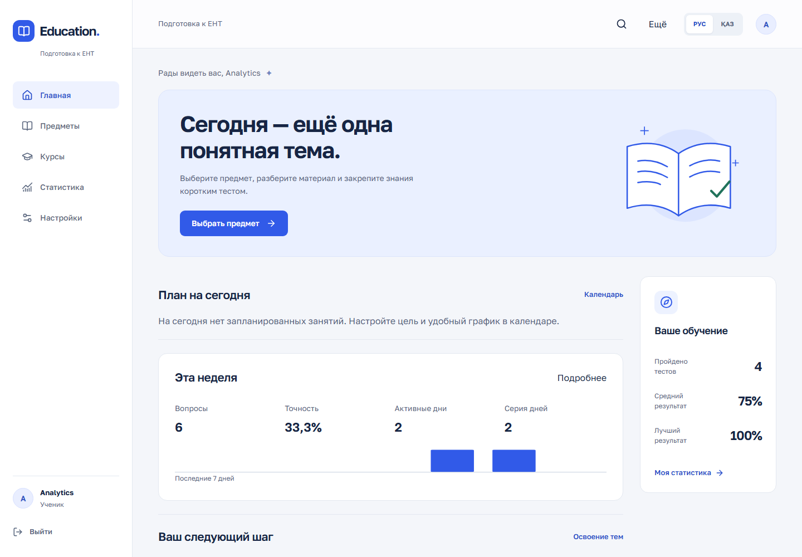
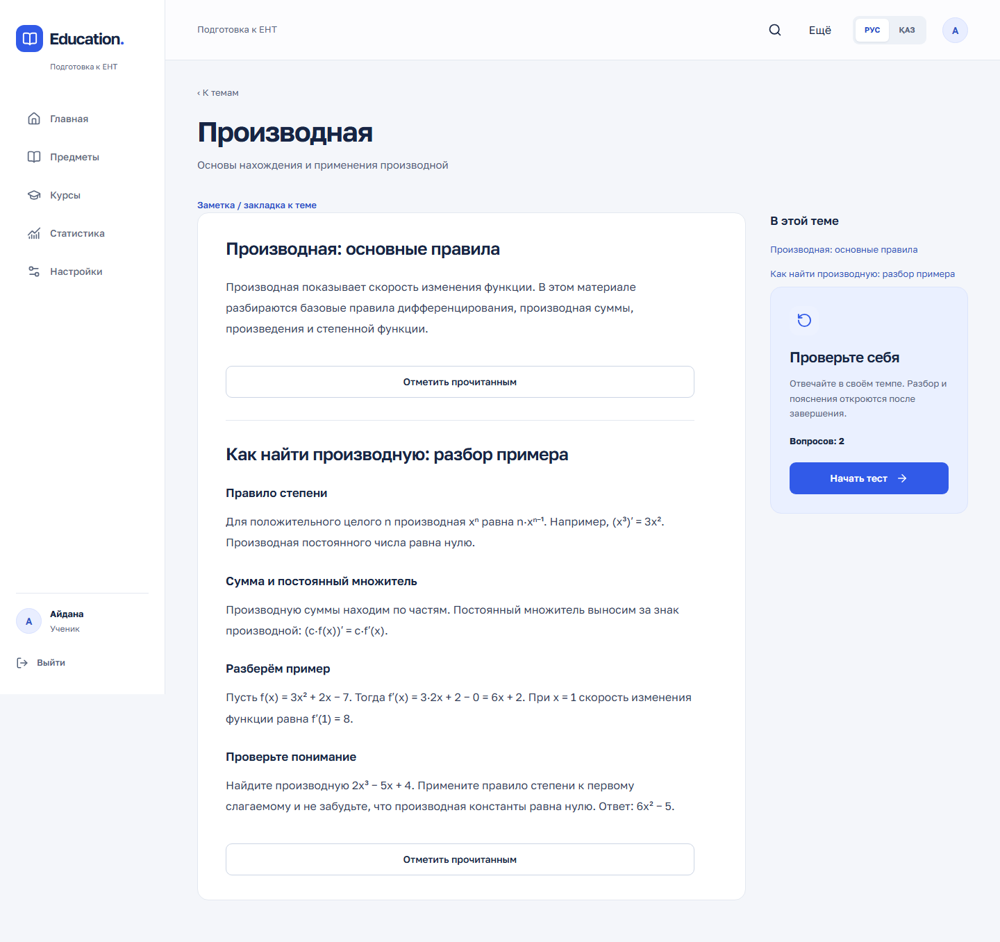
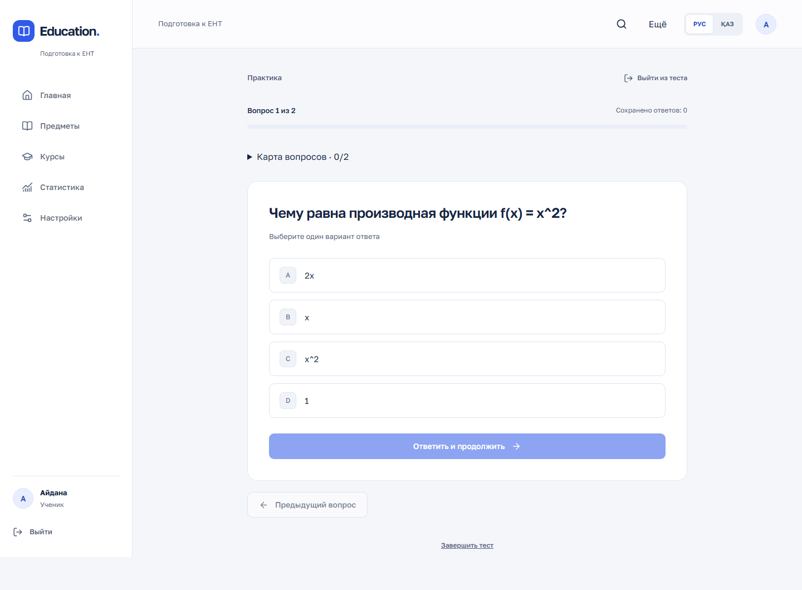
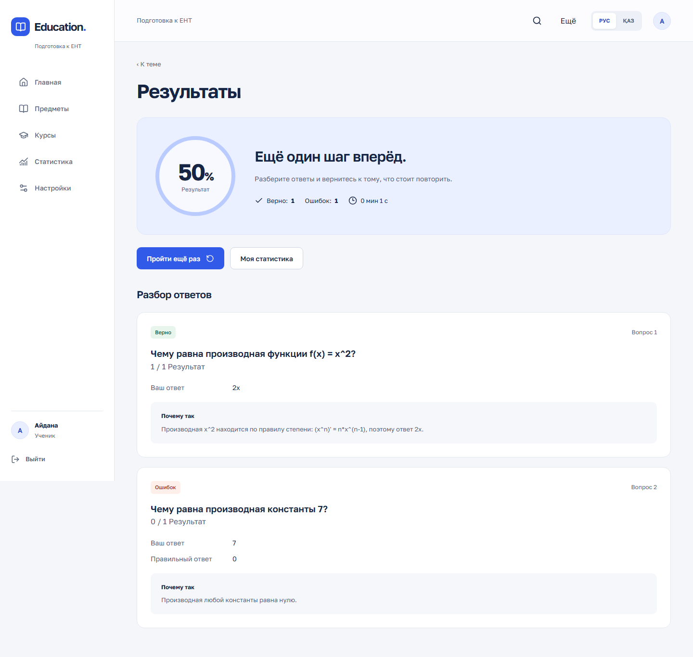
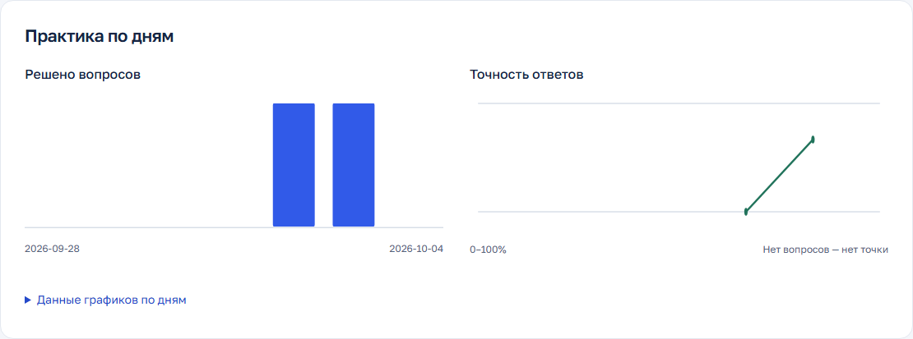
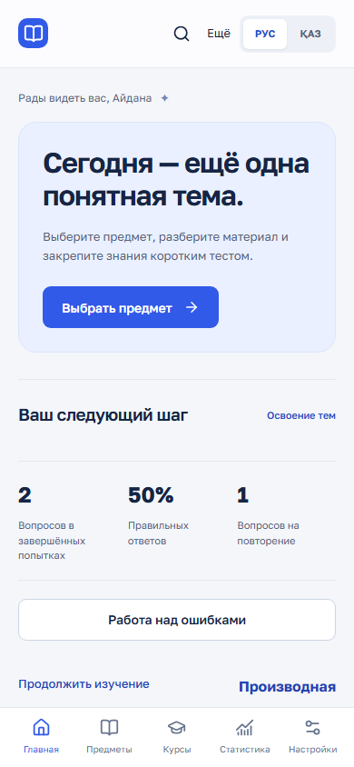
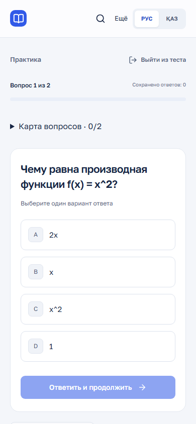

# Education App

Образовательная платформа для Казахстана: подготовка к ЕНТ / ҰБТ, курсы, Teacher/Admin CMS, группы, задания и персональный прогресс на русском и казахском языках.

Проект восстановлен из предоставленных frontend/backend архивов и объединён в monorepo. Учебный набор намеренно небольшой: **3 предмета, 4 темы, 6 вопросов и 5 материалов**. Это платформа на текущем контенте, а не полный курс или официальный банк заданий ЕНТ.



<details>
<summary>Другие экраны</summary>








Снимки сделаны автоматизированным браузером на реальной базе. Учётная запись и результаты на них созданы проверочным сценарием.
</details>

## Возможности

- [Statistics 2.0](docs/STUDENT_ANALYTICS.md): реальные 7/30-дневные и общие показатели, accuracy отдельно от частичных баллов, сравнение периодов, графики с таблицами, календарь активности и история с фильтрами. На главной — компактная недельная сводка. Отдельная `/workspace/analytics` для ADMIN/TEACHER соблюдает права на учеников и курсы.
- Первого ADMIN назначает локальный оператор: `./scripts/admin.ps1 promote user@example.com` или `sh scripts/admin.sh promote user@example.com`. Требуется подтвердить точный ID; [инструкция и ограничения](docs/STUDENT_ANALYTICS.md#first-admin-local-operator). Публичного bootstrap endpoint нет.

- Регистрация, вход, выход, восстановление сессии после обновления страницы, обработка истёкшего JWT.
- RU/KZ для навигации, форм, ошибок, теории, тестов, результатов и настроек. Язык сохраняется на устройстве и в профиле.
- Каталог предметов с реальным числом активных вопросов, темы и материалы с удобной шириной чтения.
- Сохранение ответов на сервере, продолжение незавершённого теста, подтверждение выхода и досрочного завершения.
- Правильные ответы и объяснения доступны только после завершения. Вопросы фиксируются при старте попытки.
- Статистика завершённых попыток: количество, средний и лучший результат, история, показатели по предметам.
- Responsive desktop/tablet/mobile, клавиатурные элементы управления, reduced motion и проверка контраста.
- Защищённый ADMIN CRUD API. Действующий web-кабинет учителя/редактора/администратора: [руководство CMS и LMS](docs/PLATFORM.md).

- Роли STUDENT / TEACHER / CONTENT_EDITOR / ADMIN, серверные проверки владельца и редакционные черновики с публикацией.
- Курсы, модули, уроки, тесты урока; самостоятельное/ручное зачисление и зачисление через группы.
- Задания со сроком, текстовый ответ и оценка учителя; настоящая аналитика группы.
- Загрузка PDF/DOCX/PPTX/изображений, защищённые скачивания, local/S3 storage. [Настройка файлов](docs/STORAGE.md).
- CSV/JSON импорт с валидацией, предпросмотром и атомарным созданием черновиков. [Схемы и примеры](docs/IMPORT.md).
- Освоение тем по реальным попыткам, отметки прочитанной теории, работа над ошибками с устранением повторов, поиск.

## Обновление со стабильной версии

Phase 2 создаётся поверх `28e822995620b5166c0bbca3745b16a0e4911f8b`. V1–V15 не изменены. Новые V16–V18 сохраняют старые роли, UUID контента, результаты и снимки попыток. Перед обновлением сохраните резервную копию PostgreSQL; после появления файлов резервируйте также `material_data`. Выполните `docker compose --profile app up -d --build --wait`: Flyway применит только новые миграции. Не удаляйте volumes и не выполняйте Flyway repair для обхода ошибок.

После входа STAFF видит ссылку **Кабинет**. Ученику доступны **Курсы**, **Мои задания**, **Освоение тем** и **Работа над ошибками**. Первый администратор назначается оператором по проверенному UUID; последующие назначения выполняются через **Кабинет → Пользователи**. Публичная регистрация не позволяет выбрать роль.

Расширение добавляет работающие планировщик/календарь, in-app напоминания, личные заметки/закладки/карточки, смешанную и сокращённую тренировку с серверным таймером. Файловые ответы имеют карантин, настоящую проверку ClamAV и историю версий/оценок. PWA сохраняет только явно выбранную публичную теорию; JWT, оценки и личные файлы офлайн не кэшируются.

Стартовый набор: **18 направлений, 748 пунктов официальной программы по 36 спецификациям, 45 завершённых RU/KZ тем и 450 оригинальных тренировочных вопросов**. Курс Python — 2 модуля, 6 уроков, 30 вопросов и 6 заданий. Это не полный курс ЕНТ: человеческое одобрение контента — **0**, выполнены автоматические проверки и выборочный модельный review. Полный официальный пробник заблокирован с показом дефицита банка. [Покрытие](docs/CURRICULUM_COVERAGE.md), [проверка контента](docs/CONTENT_REVIEW.md), [источники и права](docs/CONTENT_SOURCES.md).

При обновлении с Phase 2 `e39293b` применяются только **V19–V22**; V1–V18 неизменны. Для файловых отправок задайте `APP_SCAN_ENGINE=clamav`, `APP_SCAN_REQUIRED=true` и запустите `docker compose --profile app --profile malware up -d --build --wait --wait-timeout 300`. ClamAV требует дополнительной памяти; без сканера отправка студенческих файлов блокируется.

После старта откройте [локальный сайт](http://localhost:8081/). На странице входа нажмите **Создать аккаунт**, зарегистрируйте почту и пароль: будет создан ученик. Роль преподавателя/редактора назначает администратор. [Руководство CMS](docs/CMS_AUTHORING_UX.md), [план и напоминания](docs/PLANNER_NOTIFICATIONS.md), [файлы ученика](docs/STUDENT_FILES.md), [офлайн](docs/OFFLINE_POLICY.md).

Наполнение не спрятано в Flyway: оператор применяет воспроизводимый пакет через CMS preview/confirm/publication API. Команды dry-run/apply/resume/report, схема, права и PDF manifest — в [CONTENT_RELEASE](docs/CONTENT_RELEASE.md). Повтор не создаёт дублей, правки преподавателя превращаются в явно разрешаемые конфликты. Локальное применение выполнено; автоматическая публикация в production не выполняется.

## Архитектура

```text
education-app/
├── frontend/            React + strict TypeScript + Vite
├── backend/             Java 21 + Spring Boot + Maven Wrapper
├── scripts/             Настройка окружения и Python Playwright
├── docs/                Аудит, API, дизайн, проверки, screenshots
├── .github/workflows/   Backend, frontend и браузерный CI
├── .env.example
└── docker-compose.yml
```

Frontend: React 19, React Router, Tailwind 4 и небольшой собственный дизайн-комплект; Radix используется для диалогов подтверждения, Lucide — для иконок. Шрифт Golos Text хранится локально в сборке. Zod проверяет ответы API. MUI, Axios и неиспользуемые компоненты старого экспорта удалены.

Backend: Spring Boot 3.5, Spring Security, JJWT, BCrypt, Spring Data JPA, PostgreSQL 17 и Flyway. DTO отделены от entities. Тестовые изменения выполняются транзакционно с блокировкой строки попытки. Статистика агрегируется SQL-запросами по текущему пользователю.

Production-сборка: браузер → Nginx → `/api` Spring → PostgreSQL. В разработке Vite проксирует `/api` в backend. См. [аудит](docs/AUDIT.md), [дизайн](docs/DESIGN.md), [проверки и review](docs/VERIFICATION.md).

## Быстрый запуск: только Docker

Требуются Git и запущенный Docker Desktop / Docker Engine с Compose v2. Выполняйте команды из корня репозитория.

Windows PowerShell:

```powershell
.\scripts\setup.ps1
docker compose --profile app up -d --build --wait
```

Linux/macOS:

```sh
sh scripts/setup.sh
docker compose --profile app up -d --build --wait
```

Скрипт создаёт **локальный `.env` со случайными секретами**, не печатает их и сохраняет существующий файл. На Windows при запрете локальных скриптов можно выполнить `powershell -ExecutionPolicy Bypass -File scripts/setup.ps1`.

- Приложение: [http://localhost:8081](http://localhost:8081)
- Backend: [http://localhost:8080/api/test/ping](http://localhost:8080/api/test/ping)
- PostgreSQL: `localhost:55432`, база `education` (при настройке через setup).

Откройте [Создать аккаунт](http://localhost:8081/register), заполните имя, фамилию, почту и пароль (минимум 8 символов), затем войдите с этими данными. Регистрация создаёт STUDENT; готовых логинов, паролей и автоматических администраторов нет. Flyway создаёт схему и прежний небольшой seed. Новый набор 18 направлений / 45 уроков / 450 вопросов устанавливается отдельно через [content release CLI](docs/CONTENT_RELEASE.md), а не скрытой миграцией. В рабочую локальную базу этот набор уже применён и опубликован; [отчёт](docs/CONTENT_RELEASE_REPORT.md) содержит фактические результаты. Данные PostgreSQL и загруженные материалы сохраняются в отдельных Docker volumes.

Для файлов ученика включите реальный сканер: в локальном `.env` задайте `APP_SCAN_ENGINE=clamav`, `APP_SCAN_REQUIRED=true`, затем выполните `docker compose --profile app --profile malware up -d --build --wait --wait-timeout 300`. Без CLEAN-результата файл ученика нельзя прикрепить к отправленному ответу. См. [storage](docs/STORAGE.md).

Для преподавателя: администратор открывает **Кабинет → Пользователи**, находит уже зарегистрированного человека, меняет роль на TEACHER и сохраняет. Затем преподаватель открывает **Кабинет → Учебные материалы → Дополнительный курс**, добавляет модуль и урок, сохраняет черновик, прикрепляет файл на шаге содержания и проходит проверку/публикацию. Первый доверенный ADMIN создаётся оператором по [процедуре bootstrap](docs/API.md#admin-crud); публичная регистрация не принимает административные права.

```sh
docker compose --profile app ps
docker compose logs --tail 100 backend
docker compose --profile app stop
```

`stop` сохраняет контейнеры и данные. `down` также сохраняет volume; `down -v` удаляет базу, поэтому не используйте его для обычной остановки.

## Разработка с Java и Node

Требуются **JDK 21**, **Node.js 24 LTS**, npm и Docker. Maven устанавливать отдельно не нужно. Укажите `JAVA_HOME` на JDK 21, если он не настроен.

1. Создайте `.env` командой setup выше. Если полный стек уже запущен, остановите только web-сервисы, чтобы освободить порт:

```sh
docker compose --profile app stop frontend backend
docker compose up -d --wait postgres
```

2. Backend в отдельном терминале:

```powershell
.\scripts\backend.ps1 run
```

Для Linux/macOS:

```sh
set -a
. ./.env
set +a
cd backend
chmod +x mvnw
./mvnw spring-boot:run
```

3. Frontend в другом терминале:

```sh
cd frontend
npm ci
npm run dev
```

Откройте [http://localhost:5173](http://localhost:5173). Deep links и обновление защищённых страниц поддерживаются Vite и production Nginx.

### Переменные окружения

Корневой `.env` читает Compose; для Maven его загружает PowerShell-скрипт или shell-команды выше. Spring сам `.env` не загружает.

| Переменная | Назначение |
| --- | --- |
| `DB_URL` | JDBC URL для локального backend; Compose подставляет внутреннее имя `postgres` |
| `DB_USERNAME`, `DB_PASSWORD` | Доступ к БД |
| `DB_NAME`, `DB_PORT` | База и локальный порт контейнера PostgreSQL |
| `APP_JWT_SECRET` | Случайная строка длиной минимум 32 байта; обязательна |
| `APP_JWT_EXPIRATION_MS` | Время жизни JWT, по умолчанию 86400000 мс |
| `CORS_ALLOWED_ORIGINS` | Точный список разрешённых origins через запятую |
| `PORT` | Порт Spring, по умолчанию 8080 |

Frontend может использовать два варианта. По умолчанию `VITE_API_BASE_URL` пуст и Vite проксирует `/api` на `http://localhost:8080`. Чтобы изменить proxy, создайте `frontend/.env` по [примеру](frontend/.env.example) и задайте `VITE_API_PROXY_TARGET`.

Для отдельного API origin задайте `VITE_API_BASE_URL=https://api.example.org` **без `/api`**, разрешите frontend origin в backend CORS и пересоберите frontend. Это build-time переменная, она публична и не должна содержать секреты. В production Nginx также потребуется расширить `connect-src` CSP. Встроенный Docker-вариант использует единый origin и не требует этой переменной.

## Тесты

Backend API-тесты создают временный PostgreSQL через Testcontainers. Нужен работающий Docker, ручной PostgreSQL и секреты не нужны:

```powershell
.\scripts\backend.ps1 test
```

```sh
cd backend
./mvnw -B verify
```

Frontend:

```sh
cd frontend
npm ci
npm run typecheck
npm run lint
npm test
npm run build
```

Браузерный сценарий использует **настоящий backend и PostgreSQL**, включая регистрацию нового ученика. Каждый запуск добавляет только свою уникальную тестовую учётную запись. Не запускайте его против пользовательской production-базы.

Windows, после запуска Docker-стека и `npm ci` в frontend:

```powershell
python -m venv .venv
.\.venv\Scripts\python.exe -m pip install -r scripts/requirements-browser.txt
.\.venv\Scripts\python.exe -m playwright install chromium
$env:BROWSER_BASE_URL = 'http://127.0.0.1:8081'
.\.venv\Scripts\python.exe scripts/browser_tests.py
```

Linux/macOS: используйте `.venv/bin/python`; переменную можно передать как `BROWSER_BASE_URL=http://127.0.0.1:8081 .venv/bin/python scripts/browser_tests.py`. Без переменной сценарий обращается к Vite на 5173. Screenshots основных экранов находятся в `docs/screenshots`, временные трассы и JSON-отчёт — в игнорируемой `test-results/`.

GitHub Actions выполняет Java verify, чистую установку frontend, typecheck, lint, тесты, production build и браузерный сценарий с axe. Внешние secrets не требуются. Dependabot отслеживает зависимости и контейнерные образы.

Полная expansion-проверка включает `scripts/validate_content.py`, `scripts/phase2_browser_tests.py`, `scripts/expansion_browser_tests.py`, `scripts/content_browser_tests.py`, `scripts/course_content_browser_tests.py`, `scripts/content_pack_safety_tests.py` и `scripts/pwa_update_tests.py`. Порядок, точные команды и границы тестов — в [VERIFICATION.md](docs/VERIFICATION.md). Browser suites создают отдельные тестовые аккаунты/попытки и предназначены для локальной или временной CI-базы. CI не скачивает учебники и не зависит от доступности НЦТ.

## API и безопасность

[Полный обзор API](docs/API.md) содержит student/admin routes, DTO, семантику попыток, ошибки и статистику. Все учебные и пользовательские endpoints требуют `Authorization: Bearer <JWT>`. Только регистрация, вход и ping доступны без токена. ADMIN проверяется по текущей роли в БД.

- BCrypt и серверная проверка ограничения пароля в 72 UTF-8 байта; JWT проверяет подпись, срок, identity и активность пользователя.
- `401` означает отсутствие действующей сессии, `403` — недостаточную роль. Чужие попытки возвращают `404`.
- JWT хранится в `sessionStorage`: переживает refresh в текущей вкладке, удаляется при выходе и не сохраняется как постоянный логин после закрытия вкладки. Logout удаляет клиентскую сессию; отозвать отдельный уже выданный JWT сервер не умеет. Отключение пользователя блокирует все его токены.
- Повтор одинакового ответа и повтор finish безопасны. Другой повторный ответ возвращает `409`. После finish изменять ответы нельзя.
- Тексты показываются как текст, HTML из учебного контента не исполняется. Ошибки API не содержат stack traces или SQL.
- Смена темы/вопроса не меняет содержание уже созданной попытки. Старые попытки фиксируются при миграции по содержимому, доступному в момент обновления.
- Исходные миграции V1–V12 сохранены побайтно (V6 отсутствовала в архиве). V13 удаляет прежний известный тестовый аккаунт вместе с его попытками **до готовности HTTP-сервера**. В Git сохранён исторический демонстрационный hash для Flyway checksum compatibility; действующих секретов нет. Перед переносом существующей БД сделайте резервную копию и проверьте [migration notes](docs/API.md#migration-notes).

Внешний hosting не развёрнут. Перед публичным запуском настройте HTTPS, rate limits на auth endpoints, резервное копирование БД, мониторинг и отдельные production-секреты. Не публикуйте порт PostgreSQL. Текущий Compose привязывает все порты к loopback. Password reset, подтверждение почты и расширенный ERP не входят в этот этап; неработающих кнопок для них в приложении нет.
